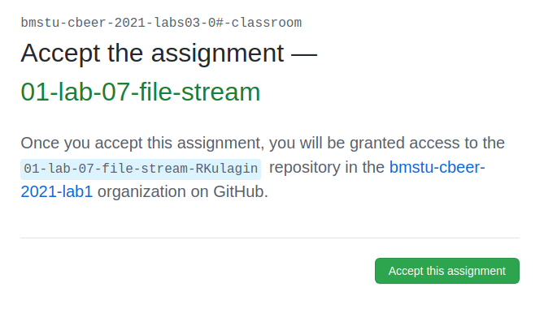

# Выполнение лабораторных работ

## Полезные материалы
К этому разделу стоит вернуться в конце, когда основные [шаги](#Инструкция) будут выполнены.
### Написанные ранее инструкции
Инструкция включает в себя материалы, написанные моими коллегами ранее. Возможно, вам будет интересно ознакомиться и с ними, но я постарался включить максимум полезной информации из них.
* [Как начать делать лабы](https://github.com/bmstu-iu8-tutors/wp_labs_windows_tutorial) от [aaaaaaaalesha](https://github.com/aaaaaaaalesha) & [rkulagin](https://github.com/rkulagin)
* [Тестирование лабораторных работ в Windows](https://github.com/zinstack625/Lab_Test_Guide) от [zinstack625](https://gist.github.com/zinstack625)
* [Гайд для Linux по git](https://github.com/A-Lazar-A/Guide) от [A-Lazar-A](https://github.com/A-Lazar-A)

### Полезные и интересные статьи по инструментам
* [Доклад про Git от Яндекса](https://www.youtube.com/watch?v=XfpNNPo5ypk)

## Инструкция

### Необходимые утилиты

<details>
  <summary>Windows</summary>
  
Хотим предостеречь от выполенения лабораторных работ на ОС Windows. 
Установка и необходимого софта на ней дело, которое может занять несколько часов, а количество проблем, возникающих в процессе отбивают всякое желание продолжать. Линукс - то, с чем вам всё равно придётся подружиться рано или поздно, если вы планируете стать разработчиком. 

Если Windows важен для других задач, можно установить две сimgистемы параллеьно (любимый поисковик вам поможет).

Если мы всё-таки пока не убедили, то смотри [гайд по настройке для винды](https://github.com/zinstack625/Lab_Test_Guide).
  
</details>
<details>
  <summary>Linux (Ubuntu)</summary>
  
  Для Ubuntu выполните команды в терминале (Copyright Антон Климанов):
```sh
#!/bin/bash
sudo apt install python3 clang gcc cmake build-essential docker.io libgtest-dev libgmock-dev
sudo systemctl enable docker && sudo systemctl start docker
pip3 install cpplint
echo 'export PATH=$PATH:/home/$USER/.local/bin' >> ~/.bashrc
```
</details>
<details>
  <summary>Mac OS</summary>

  Самостоятельно установите:
  
* Python 3
* clang
* [gcc](https://discussions.apple.com/thread/8336714)
* cmake
* [docker](https://docs.docker.com/desktop/mac/install/)
* [cpplint](https://formulae.brew.sh/formula/cpplint)

Можно воспользоваться [HomeBrew](https://brew.sh/) для установки пакетов.

</details>

Мы рекомендуем использовать [CLion от JetBrains](https://www.jetbrains.com/ru-ru/clion/), так как она наиболее адаптирована для работы с CMake для начинающих. 

<details>
  <summary>Скачиваем CLion и получаем студенческую лицензию</summary>
Необходимо:

* Подать заявку на предоставление бесплатной лицензии [JetBrains Products for Learning](https://www.jetbrains.com/shop/eform/students)


(То, что подчёркнуто красным нужно заполнить)

* Скачать [CLion](https://www.jetbrains.com/clion/)


* Установить CLion. 

Установка стандартная, ничего дополнительно нажимать не требуется(только при желании это сделать)

* Активировать CLion, используя университетскую почту
(P.S. если вы её до сих пор не получили, получите в ГЗ в 91 кабинете)

</details>


### Создание репозитория

Для того, чтобы создать индивидуальный репозиторий с лабораторной работой нужно нажать на ссылку ниже 
(одна ссылка -- одна работа). 
После чего нажать на кнопку `Accept this assignment`.

После чего появится следующая страница:

Обновите страницу, после чего получите ссылку на индивидуальный репозиторий.

Так выглядит репозиторий:

### Выполение лабораторной работы


Git перестал поддерживать использование пары логин-пароль для клонирования репозитория, поэтому мы рекомендуем использовать 
доступ по ssh. Инструкция, как настроить ssh для вашей ОС доступен по [ссылке](https://docs.github.com/en/authentication/connecting-to-github-with-ssh/generating-a-new-ssh-key-and-adding-it-to-the-ssh-agent) (обратите внимание на последний пункт инструкции, ключ нужно добавить и на github).

Клонируем репозиторий, нажав на кнопку Code, выбираем ssh и нажимаем кнопку для копирования ссылки. 

Переходим в терминал (или открываем Git Bash в Windows), в котором переходим в папку, в которой будет располагаться наш репозиторий локально. 

```sh
git clone <ссылка на ваш репозиторий>
cd <название репозитория>
git checkout -b wp/lab
git submodule update --init
```

При помощи команды `git branch` проверьте, что вы находитесь в ветке `wp/lab`, если это не так, повторите команду 3 из списка выше (возможно, нужно убрать флаг -b).

После чего запускаем CLion, выбрая пункт `New CMake Project from Sources` или `File -> New CMake Project from Sources`.

Выбираем папку с локальным репозиторием (обратите внимание, нужна именно папка, содержащая папку .git)

.

* Важно! Нажимаем Open Existing Project. Иначе CMakeLists.txt перезапишется


* Готово. Если делаете всё в первый раз на данной машине, то стоит немного подождать, пока Hunter(специальный пакетный менеджер) скачает и установит необходимые зависимости.  

### Начинаем работу c CLion и лабками.

Зачастую лабы суть лаб состоит в том, чтобы вы закодили то, что необходимо по заданию. 
Делается это, как правило в директориях sourses/... - .cpp файлы и include/... - .hpp (подробнее на самих лабах)
Не вдаваясь в подробности, после того как всё сделано, ваш код проходит так называемые unit-тесты. Если интересно их содержание
можно посмотреть тут: /tests/test.cpp В общем и целом они нужны, чтобы подготовленные входные данные автоматически прогонялись через
ваше решения, а выходные данные, в свою очередь, проверялись на правильность. Плохим тоном является выгружать лабу на проверку удалённому
тестировщику TravisCI до того, как вы убедились, что тесты прошли локальную проверку у вас.

Давайте разбёремся, как запускать тестики на вашей машине.

Вот наше окно в CLion с какой-то открытой лабой.


Если вы видите ошибку

```cmake
CMake Error at CMakeLists.txt:14 (include):
  include could not find load file:
    tools/gate/cmake/HunterGate.cmake
```

значит у вас не установлены необходимые подмодули. Чтобы это исправить, скопируйте и вставьте эти команды в терминал / git bash находясь в корне локального репозитория

```sh
git submodule update --init
```
или

```sh
git submodule add https://github.com/cpp-pm/polly tools/polly
git submodule add https://github.com/cpp-pm/gate tools/gate
```

Немного пробежимся по среде разработки.

Слева мы наблюдаем всю файловую иерархию нашего проекта.

Снизу поле для вывода. Туда выводятся всевозможные ошибки CMake, а также там
мы будем видеть, как проходят наши тестики.

Ну по центру место, где будем писать код, с подсветкой синтаксиса, автодополнениями
и другим разработческим сахаром.

Итак, внимание в правый верхний угол. Если сборка вашего проекта прошла успешно (при условии что вы выполнили все пункты выше),
то у вас будет похожая картина.


Для того, чтобы запустить тестирование, нажимаем на зелёный треугольничек, и смотрим в окно вывода:


Если вы видете подобное(`RUN   OK` и в конце `[  PASSED  ]`) - у вас всё прекрасно, тестики прошли успешно. 
Однако в большинстве случаев первый вывод больше похож на что-то такое:

```shell script
Running main() from gtest_main.cc
[==========] Running 11 tests from 1 test case.
[----------] Global test environment set-up.
[----------] 11 tests from Matrix
[ RUN      ] Matrix.Init
[       OK ] Matrix.Init (0 ms)
[ RUN      ] Matrix.CopyAssign
[       OK ] Matrix.CopyAssign (0 ms)
[ RUN      ] Matrix.Add
D:\GitHub\02-lab-03-matrix-aaaaaaaalesha\tests\matrix_unittests.cpp:48: Failure
Expected equality of these values:
  s.Rows()
    Which is: 1
  2
[  FAILED  ] Matrix.Add (0 ms)
[ RUN      ] Matrix.AddEmpty
D:\GitHub\02-lab-03-matrix-aaaaaaaalesha\tests\matrix_unittests.cpp:65: Failure
Expected equality of these values:
  s.Rows()
    Which is: 4294967295
  0
[  FAILED  ] Matrix.AddEmpty (0 ms)
[ RUN      ] Matrix.Sub
D:\GitHub\02-lab-03-matrix-aaaaaaaalesha\tests\matrix_unittests.cpp:79: Failure
Expected equality of these values:
  s.Rows()
    Which is: 1
  2
[  FAILED  ] Matrix.Sub (0 ms)
[ RUN      ] Matrix.SubEmpty
D:\GitHub\02-lab-03-matrix-aaaaaaaalesha\tests\matrix_unittests.cpp:94: Failure
Expected equality of these values:
  s.Rows()
    Which is: 4294967295
  0
[  FAILED  ] Matrix.SubEmpty (0 ms)
[ RUN      ] Matrix.Mult
D:\GitHub\02-lab-03-matrix-aaaaaaaalesha\tests\matrix_unittests.cpp:126: Failure
Expected equality of these values:
  s.Rows()
    Which is: 2
  3
[  FAILED  ] Matrix.Mult (0 ms)
[ RUN      ] Matrix.Transposition
[       OK ] Matrix.Transposition (0 ms)
[ RUN      ] Matrix.Minor
[       OK ] Matrix.Minor (0 ms)
[ RUN      ] Matrix.Det
D:\GitHub\02-lab-03-matrix-aaaaaaaalesha\tests\matrix_unittests.cpp:234: Failure
Expected equality of these values:
  n.Det()
    Which is: 0
  343.
    Which is: 343
[  FAILED  ] Matrix.Det (1 ms)
[ RUN      ] Matrix.Inverse
[       OK ] Matrix.Inverse (0 ms)
[----------] 11 tests from Matrix (8 ms total)

[----------] Global test environment tear-down
[==========] 11 tests from 1 test case ran. (9 ms total)
[  PASSED  ] 5 tests.
[  FAILED  ] 6 tests, listed below:
[  FAILED  ] Matrix.Add
[  FAILED  ] Matrix.AddEmpty
[  FAILED  ] Matrix.Sub
[  FAILED  ] Matrix.SubEmpty
[  FAILED  ] Matrix.Mult
[  FAILED  ] Matrix.Det

 6 FAILED TESTS

Process finished with exit code 1
```

Тут тестики пытаются вам намекнуть, какой результат ожидался, а какой был выдан вашей 
программой. Так что попытайтесь отдебажить ваш код - поставить точки остановки на 
строчках, где временно хотите остановить программу и начать идти по ней "по шагам": 


и нажмите на зелёного жучка в той же верхней области (справа от стрелочки).


Видим, что мы вошли в режим дебаггера


Далее можно поиграть с клавишами F8(step over) и F7(step into) - шаг с обходом и шаг
с заходом соответственно. Внизу можем наблюдать локальные и глобалльные переменные и то,
как они изменяются, пока мы шагаем по программе.


Процесс дебаггинга легко остановить нажатием на красный квадратик в той же верхней правой 
строке.

#### Clang формат. Горячие клавиши.

В нашем ремесле существует специальная утилита clang-format. Она позволяет автоматически форматировать ваш код.
К примеру рассмотрим код до и после применения этой утилиты:

До:
```c++
        #include <iostream>

int  main( ) {std::cout<<"Hello world!"         <<std::endl;

    return 0;}
```

Понятно, что такой код читать неприятно, а убирать все пробельчики и табуляции ручками неудобно.

Так что применим нашу утилиту и придадим коду удобоворимый вид:

```c++
#include <iostream>

int main() {
    std::cout << "Hello world!" << std::endl;

    return 0;
}
```

Как это настроить:

Окно Clion: `File->Settings->Keymap`

Вводим в окно поиска "Reformat code" и смотрим


 
Тут настроено сочетание клавиш `Ctrl+Alt+L`. Если у вас такого нет, то настройте и нажмите `Apply`.

После этого вы сможете опробовать утилиту в действии!

## Проверка лабораторной работы и получение галочек

После того, как все тесты локально проходят, необходимо выполнить тестирование в защищённом окружении. Как запускать его в Windows, смотрите в гайде, который рекомендовался при настройке окружения для Windows. 

Для Linux/MacOS
```sh
sudo rm -r cmake-build-debug/
docker run -v `pwd`:`pwd` -w `pwd` --cap-add=SYS_PTRACE -t rusdevops/bootstrap-cpp scripts/checks.sh && docker run -v `pwd`:`pwd` -w `pwd` -t rusdevops/bootstrap-cpp scripts/tests.sh && ./scripts/genenv.sh && docker run --env-file .env -v `pwd`:`pwd` -w `pwd` -t rusdevops/bootstrap-cpp scripts/coverage.sh;
sudo rm -r _builds/
```

## Отправка изменений на github
В случае, если никаких ошибок не возникло, значит можно коммитить и пушить на удалённый сервер. 


Прежде всего проверьте, что в файле `.gitignore` есть следующие строки
```sh
.idea/
cmake-build-*
_builds/
```

После этого командой `git status` в терминале посмотрите, какие файлы у вас были изменены и добавьте каждый из них при помощи команды `git add <имя файла>`. Обратите внимание, что служебные файлы и те файлы, которые вы сами не меняли вносить на сервер не нужно. 
После того, как все файлы будут добавлены пропишите команду 
```sh
git commit -m "Напишите тут сопроводительное сообщение"
```
И выполните `git push`. После этого на github появятся ваши изменения.

Переходим на страницу с лабой в браузере, переключаемся на ветку `wp/lab`:


Тут у вас появится подобная рыжая вкладочка с предложением создания pull request'a


Нажимаем `Compare & pull request`, даём ему имя `wp/lab` и продолжаем.

Далее вашу лабу начнёт проверять система автоматизированной сборки и проверки тестиков.

Получив у него галочки по всем пунктам можно отсылать ссылку на pull request своему
преподавателю. Дальше он будет вносить свои коррективы в ваш код.


По всем возникающим вопросам пишите в Slack в соотвествующий канал или почитайте историю вопросов там, возможно, на него уже дан ответ.

```sh
Copyright 2020-2022 Ruslan Kulagin, Alexey Aleksandrov, Anton Klimanov
```